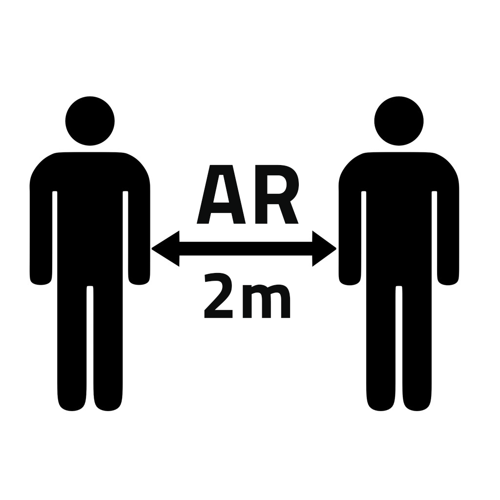
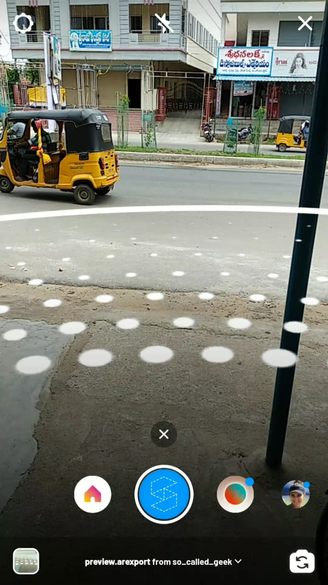
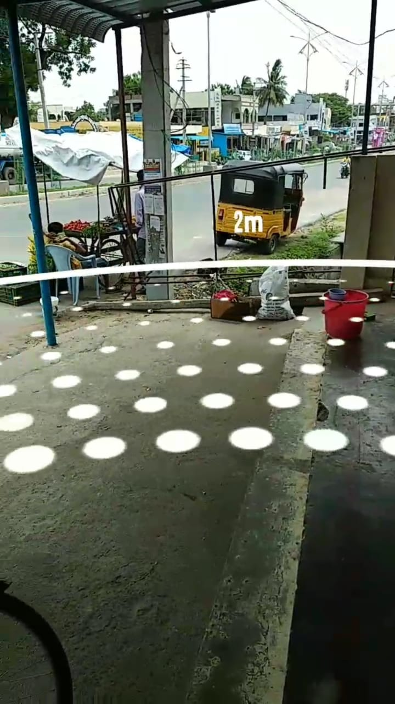
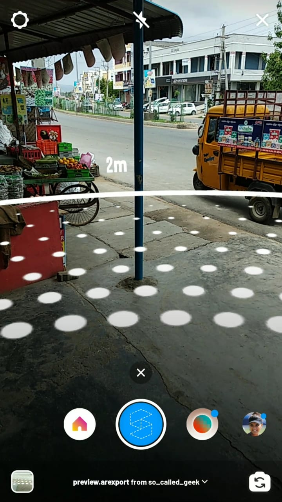

# AR-Social-Distancing

  
  
  

#### Visualising 2 meter Social Distance made Simpler

### [Submitted for Facebook AR Hackathon]()

### ✨ [Try the filter on Instagram](https://www.instagram.com/ar/1555168924639277/?ch=YzhiOTcwODc5MjNlNzI3YWRlMmFjNDQ5ZjZmYTljY2I%3D)

### 📺 [Checkout Demo Video On Youtube](https://youtu.be/mKHreExFdK4)

## Inspiration
We are required to follow the lockdown guidelines and social distancing norms to stop the spread of the coronavirus. The United Nations made an app called 1point5 to help you achieve a distance of 1.5 metres from your fellow human beings. However, the app requires people around to have Bluetooth turned on to notify you if they enter your vicinity. We want to come up with an idea of developing an AR tool which makes this process easier. Neither does it require you to install any kind of app nor does it need the people around you to have their phone on them.

## What it does
It uses Camera to visualise a two-meter radius ring around you to help you maintain social distancing. The app superimposes the 2-metre or a 6.5 feet virtual ring on the viewfinder and moves with the user in the form of a circle. Users can open the Instagram Camera and go to this Filter to launch the AR tool. The interface is simple and is similar to the smartphone game PokemonGo which uses the perimeter augmented reality technology.

## How I built it
I have built using Spark AR studio which has amazing tools which make it super simple to make 3d World Filter

## Challenges I ran into
The major challenge I ran into is adjusting the scale to match the real world distance of 2m. Later using the official documentation I was able to Achieve it easily.

## Accomplishments that I'm proud of
I learnt about various features of Spark AR Studio. Apart from this World Filter I also built a Quiz Game using Face Tracking which is really amazing.

## What's next for QSafe
I wish to add a feature which warns the users whenever an object enters into the 2m circle

## Screenshots
<table>
    <tr>
     <td><kbd></kbd></td>
     <td><kbd></kbd></td>
     <td><kbd></kbd></td>
    </tr>
</table>

## How to Edit Files

* Download [Spark Ar Studio](https://sparkar.facebook.com/ar-studio/) and Open .arproj files
* Use PSD's available in RAW_RESOURCES folder as templetes to generate Questions and Answers based on your requirements
* Replace corresponding files in Spark AR project to make your own filter
* Make changes to patch editors if required

## Show your support

Give a ⭐️ if this project helped you!

 **Made with ❤ Nitish Gadangi**

